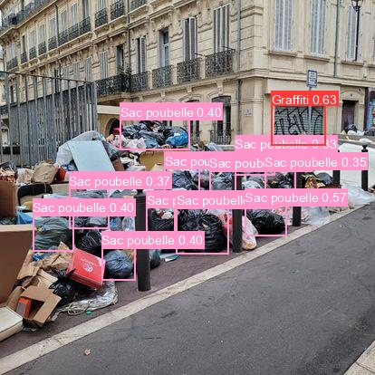

    
    <a href="https://image-mpp-app-ddlzhsitgq-ew.a.run.app"><h1 align="center"  style="padding-top: 0px ; margin-top: 0px">Mantes + Propre</h1></a>

> 
🌳🌍 Agissons ensemble pour une mantes plus jolie ! 🌳🌍

## Contexte 🚮

La ville de Mantes-la-Jolie est confrontée à un défi environnemental significatif en raison de la prolifération des déchets sauvages. 

Les déchets sauvages sont définis comme tous les types de détritus jetés ou abandonnés dans des lieux publics, incluant des emballages, des bouteilles, des canettes, et autres résidus qui ne sont pas correctement disposés dans des poubelles ou des centres de recyclage. Ils constituent une source majeure de pollution visuelle et environnementale, dégradant la beauté et la salubrité de la ville. 

L'objectif de notre projet est de mettre en œuvre une solution innovante utilisant le deep learning pour **identifier, classifier et cartographier ces déchets**, facilitant ainsi leur gestion par les services municipaux et améliorant la propreté urbaine.

## **Fonctionnalités Clés de l'Application**

Notre application est conçue pour être simple et intuitive, permettant aux utilisateurs de signaler les déchets sauvages et de contribuer à la propreté de la ville. 

Voici les principales fonctionnalités de l'application :

- Les utilisateurs peuvent **uploader des images de déchets** depuis leur smartphone, qui sont automatiquement géolocalisées.
- **Visualisation d'une carte interactive** montrant la répartition des déchets détectés dans la ville.
- Nous accordons une attention particulière à la confidentialité : **Floutage automatique des visages et plaques d'immatriculation** pour respecter la confidentialité.
- **Accès direct à Google Maps** pour localiser précisément les déchets signalés.
- TODO : **Optimisation de parcours** proposant l'itinéraire le plus efficace pour la collecte des déchets.

## Contributeurs

- Mlamali SAID SALIMO
- Nelly GUEPNANG
- Jallal KHAIRAOUI
- Hajar BOULAHYA
- Cécilia KWAKWA

---

<h2 align="right">Contact</h2>

  
📬 mlamali.saidsalimo [ at ] gmail.com 📬

  
Find me on <a href="https://www.linkedin.com/in/mlamalisaidsalimo/">LinkedIn</a> or read me on <a href="https://medium.com/wanabilini">Medium !</a>

