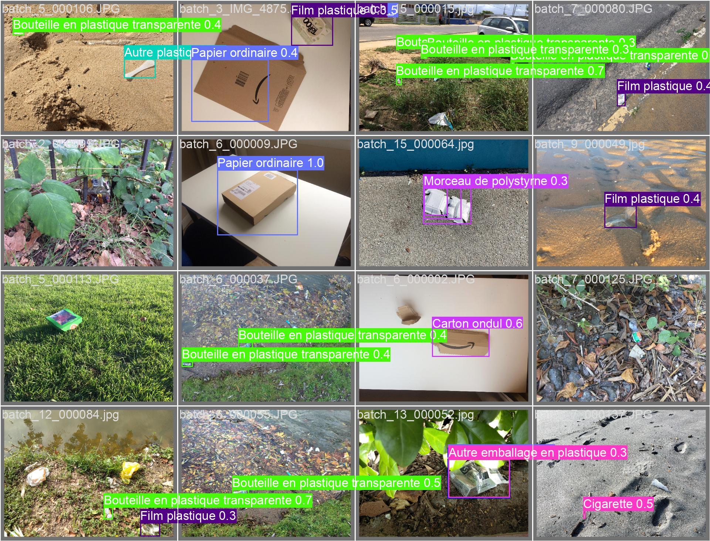

# "Mantes + Propre" 

> Agissons ensemble pour une mantes plus jolie !




## Installation

Après avoir crée un venv, utilisez la commande `pip install -r requirements.txt` pour installer les dépendances.

Ensuite, créez un fichier `.env` à la racine du projet et ajoutez-y les variables suivantes :

```
REPLICATE_API_TOKEN=your_replicate_api_token # for the generation of cartoon
BASEROW_DB_API_TOKEN=your_baserow_db_api_token # access to the baserow database
```

## Lancement

Pour lancer l'application, utilisez la commande `python streamlit run app.py`.

## Structure du projet

## Déploiement

### Construction des images Docker

```shell
# Construire l'image Docker pour le backend
docker build -t image-mpp-api -f Dockerfile-api .
# Construire l'image Docker pour le frontend
docker build -t image-mpp-app -f Dockerfile-app .
```

### Démarrage des conteneurs

Démarrer les deux services dans des conteneurs Docker distincts.

```shell
# --- Démarrer le serveur FastAPI
echo "Démarrage du serveur FastAPI..."
docker run --name mpp-api -p 8000:8000 -v shared_volume:/app/.inference image-mpp-api
#docker run --name mpp-api -p 8000:8000 -v "N:\My Drive\KESKIA Drive Mlamali\Mantes-Plus-Propre\.inference":/app/.inference image-api-mpp

# --- Démarrer le serveur Streamlit
echo "Démarrage du serveur Streamlit..."
docker run --name mpp-app -p 8501:8501 -v shared_volume:/app/.inference image-mpp-app
#docker run --name mpp-app -p 8501:8501 -v "N:\My Drive\KESKIA Drive Mlamali\Mantes-Plus-Propre\.inference":/app/.inference image-app-mpp


echo "Les serveurs sont démarrés."
```


